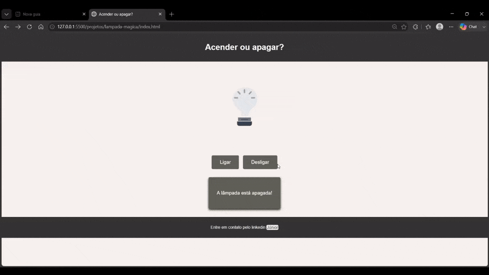

# Lampada Magica

Um projeto simples mas eficiente para treinar lógica e interação com javascript, estruturação de páginas com html e estilização e responsividade com css.

# Sobre o projeto

Este projeto foi criado como exercicio de pratica com manipulacao do DOM, eventos de clique e troca dinamica de conteudo na pagina.

## Como executar

1. Abra a pasta do projeto no VS Code.
2. Inicie o Live Server a partir do arquivo `index.html`.
3. Clique em **Ligar** ou **Desligar** para alternar o estado da lampada.

## Visualizacao do projeto

## Aprendizados

- Selecao de elementos com `getElementById`.
- Alteracao de atributos como `src` e `alt`.
- Atualizacao de texto na pagina com `textContent`.
- Uso de eventos de clique para criar interatividade.

